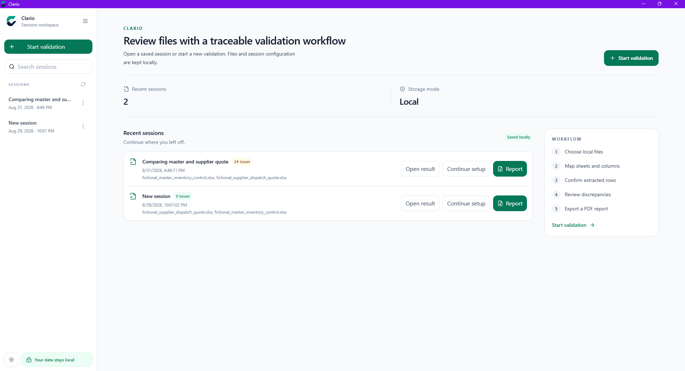
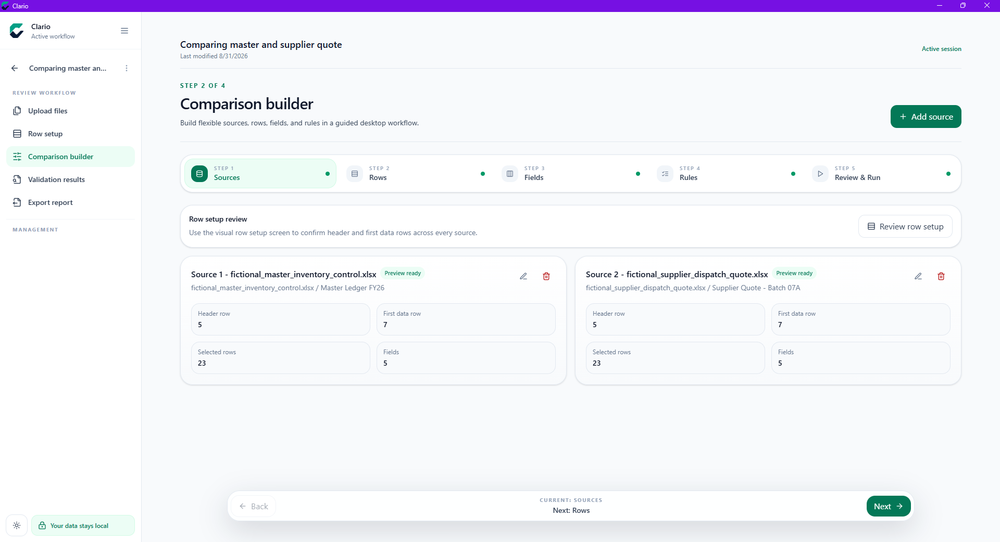

<div align="center">


# Clario

### The Modern Workspace for Spreadsheet Validation

**Validate Smarter. Compare Faster. Trust Every Decision.**

<p>
A desktop application for comparing, validating, and auditing spreadsheet data through configurable workflows, reusable templates, and automated reporting.
</p>

<br>

<p align="center">
<a href="https://www.microsoft.com/en-us/windows"></a>
<a href="https://www.electronjs.org/"></a>
<a href="https://react.dev/"></a>
<a href="https://www.typescriptlang.org/"></a>
<a href="https://fastapi.tiangolo.com/"></a>
<a href="https://www.sqlite.org/"></a>
</p>

</div>

---

# Table of Contents

- [Clario](#clario)
    - [The Modern Workspace for Spreadsheet Validation](#the-modern-workspace-for-spreadsheet-validation)
- [Table of Contents](#table-of-contents)
- [Why Clario](#why-clario)
- [Features](#features)
- [Screenshots](#screenshots)
  - [Application Overview](#application-overview)
  - [Comparison Builder](#comparison-builder)
  - [Validation Results](#validation-results)
- [Use Cases](#use-cases)
- [Technology Stack](#technology-stack)
- [Architecture](#architecture)

---

# Why Clario

Manual spreadsheet validation is repetitive, time-consuming, and prone to human error.

Clario provides a structured workspace for comparing, validating, and auditing spreadsheet data through reusable templates, configurable validation rules, persistent sessions, and automated reports.

Built for workflows where accuracy matters, Clario helps teams identify inconsistencies faster and maintain reliable data validation processes.

---

# Features

<table>

<tr>

<td width="50%" valign="top">

<h3>

Spreadsheet Validation
</h3>

Compare and validate spreadsheet files with support for:

- Item descriptions
- Quantities
- Units
- Pricing data
- Missing records
- Data inconsistencies

</td>

<td width="50%" valign="top">

<h3>

Comparison Builder
</h3>

Create configurable validation workflows using:

- Field mapping
- Comparison rules
- Custom validation logic
- Reusable templates

</td>

</tr>

<tr>

<td width="50%" valign="top">

<h3>

Automated Reports
</h3>

Generate professional validation reports containing:

- Comparison summaries
- Detected discrepancies
- Audit information
- Exportable documentation

</td>

<td width="50%" valign="top">

<h3>

Persistent Sessions
</h3>

Continue previous validation projects with:

- Saved configurations
- Previous comparisons
- Historical records

</td>

</tr>

<tr>

<td width="50%" valign="top">

<h3>

Modern Interface
</h3>

Designed with:

- Clean workspace layout
- Light and dark themes
- User-focused experience

</td>

<td width="50%" valign="top">

<h3>

Desktop Application
</h3>

A native desktop experience powered by Electron.

</td>

</tr>

</table>

---

# Screenshots

## Application Overview



## Comparison Builder



## Validation Results


---

# Use Cases

<table>

<tr>
<th>Area</th>
<th>Description</th>
</tr>

<tr>

<td>
Procurement
</td>

<td>
Validate supplier quotations, bidding documents, and purchase records.
</td>

</tr>

<tr>

<td>
Finance
</td>

<td>
Compare financial spreadsheets and identify inconsistencies.
</td>

</tr>

<tr>

<td>
Inventory
</td>

<td>
Audit product lists, quantities, and stock information.
</td>

</tr>

<tr>

<td>
Operations
</td>

<td>
Standardize spreadsheet validation workflows across teams.
</td>

</tr>

</table>

---

# Technology Stack

<details open>

<summary><strong>Frontend</strong></summary>

<br>

<table>

<tr>

<td align="center">

<a href="https://react.dev/">

</a>

<br>

React

</td>

<td align="center">

<a href="https://www.typescriptlang.org/">

</a>

<br>

TypeScript

</td>

<td align="center">

<a href="https://vite.dev/">

</a>

<br>

Vite

</td>

<td align="center">

<a href="https://tailwindcss.com/">

</a>

<br>

Tailwind CSS

</td>

</tr>

</table>

</details>

<details open>

<summary><strong>Backend</strong></summary>

<br>

<table>

<tr>

<td align="center">

<a href="https://fastapi.tiangolo.com/">

</a>

<br>

FastAPI

</td>

<td align="center">

<a href="https://www.sqlite.org/">

</a>

<br>

SQLite

</td>

</tr>

</table>

</details>

<details open>

<summary><strong>Desktop Runtime</strong></summary>

<br>

<a href="https://www.electronjs.org/">

</a>

<br>

Electron

</details>

---

# Architecture

```text
Spreadsheet Files

        │

        ▼

File Processing Layer

        │

        ▼

Comparison Configuration

        │

        ▼

Validation Engine

        │

        ▼

Results Processing

        │

        ▼

Report Generation
```
